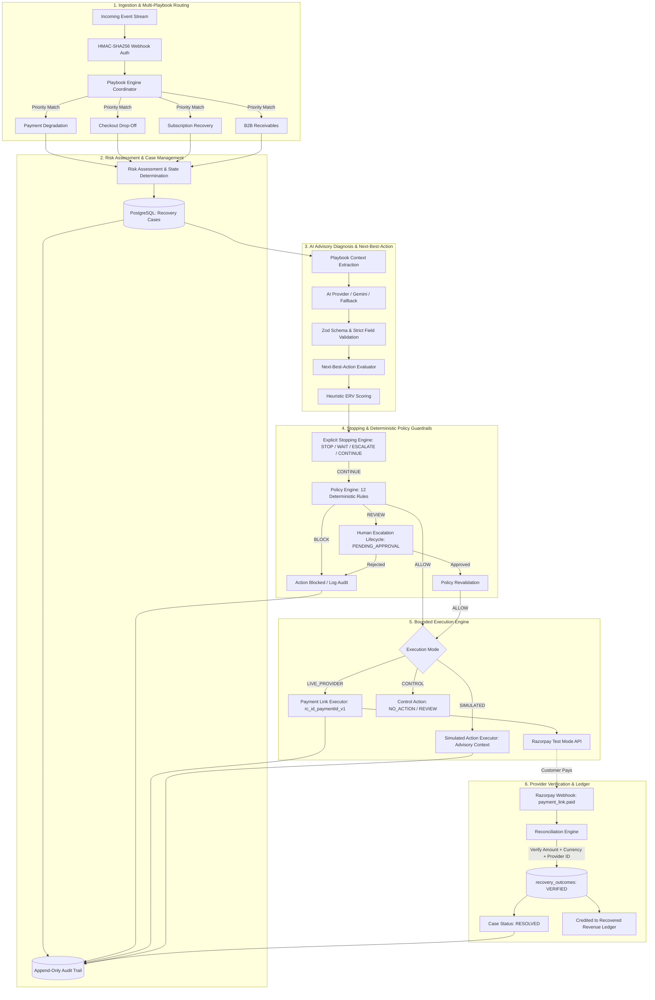

# Revflow — AI Revenue Recovery Control Plane

> **Revflow detects revenue leaks, diagnoses the underlying context, selects bounded recovery strategies, enforces deterministic financial guardrails, executes only permitted actions, verifies provider outcomes, and analyzes recovery performance.**

[](https://razorpay.com)
[]()
[]()
[](https://nodejs.org)
[](https://postgresql.org)
[](https://razorpay.com)
[]()

🌐 **Demonstration Deployment**: [https://revflow.onrender.com](https://revflow.onrender.com) *(prototype demo environment)*  
📖 **Technical Architecture Guide**: [docs/architecture.md](docs/architecture.md)

---

## 1. Product & Value Proposition

When a payment fails at checkout, during subscription renewal, or against a B2B invoice, traditional payment infrastructure simply logs an error and stops. Merchants face silent revenue leakage across multiple domains:
- **Transient Gateway & Network Drops**: Peak-hour bank switch timeouts abandon buyers who would pay if given a direct fallback link.
- **Checkout Drop-Off & Hesitation**: Customers abandon checkout during OTP entry or authentication friction without an automated recovery path.
- **Involuntary Subscription Churn**: Recurring card charges fail due to temporary limit exhaustion or maintenance windows.
- **Aged B2B Receivables**: Manual invoice collections are slow, unstructured, and lack term-aware chasing logic.

Revflow transforms revenue recovery from passive error logging into an **autonomous, bounded control plane**:

```text
       ┌─────────────┐
       │ AI Proposes │ (Advisory hypothesis grounded strictly in observed signals)
       └──────┬──────┘
              ▼
     ┌─────────────────┐
     │ Policy Decides  │ (Authoritative deterministic financial guardrails)
     └────────┬────────┘
              ▼
       ┌─────────────┐
       │Executor Acts│ (Bounded Razorpay Payment Link or Simulated Strategy)
       └──────┬──────┘
              ▼
     ┌─────────────────┐
     │Provider Verifies│ (External signed webhook with HMAC-SHA256 signature)
     └────────┬────────┘
              ▼
     ┌──────────────────┐
     │Revflow Reconciles│ (Verifies identity, exact amount, currency & credits ledger)
     └──────────────────┘
```

```text
DETECT  →  CONTEXT  →  DIAGNOSE  →  NEXT-BEST-ACTION  →  STOP / WAIT / ESCALATE  →  POLICY  →  BOUNDED EXECUTION  →  VERIFY  →  RECONCILE  →  ANALYZE
```

> [!IMPORTANT]
> **AI never touches merchant money directly.**  
> In Revflow, AI is strictly advisory. It diagnoses context and proposes next-best actions. Only a deterministic, server-side policy engine holds the authority to approve an action. Even then, execution is bounded, fail-closed, and never counted as revenue until confirmed via a provider-signed webhook and verified through reconciliation (checking provider identity, exact amount, currency, and action correlation).

---

## 2. Verified Proof & Current Results

Revflow is backed by authoritative test-mode ledger proof and comprehensive automated verification:

- ✅ **3/3 current Test Mode recovery cases resolved** in the verified demonstration batch
- ✅ **₹1,750 verified recovered revenue** through closed-loop Razorpay Test Mode workflows
- ✅ **100% recovery on the current 3-case Test Mode batch** *(strictly scoped to this demonstration batch; not a universal product claim)*
- ✅ **408/408 automated tests passing** across 17 comprehensive test suites (`pnpm test`)
- ✅ **Four active revenue recovery playbooks** operating on a single unified control plane
- ✅ **Adversarial Financial Safety Suite** with 81 dedicated adversarial security tests
- ✅ **Next-Best-Action (NBA) Engine** with deterministic Expected Recovery Value (ERV) heuristic scoring
- ✅ **Explicit Explainable Stopping Engine** (`STOP`, `WAIT`, `ESCALATE`, `CONTINUE`)
- ✅ **Human Escalation Lifecycle** (`PENDING_APPROVAL` $\rightarrow$ `APPROVED` / `REJECTED`) where human approval can never override `BLOCK`
- ✅ **Batch Revenue Recovery** with strict provenance separation (`SIMULATED_BATCH` vs `TEST_MODE_VERIFIED`)
- ✅ **Portfolio Outcome Intelligence** covering velocity, failure modes, stopping reasons, and strategy performance
- ✅ **Operational Agent Evaluation Telemetry** tracking schema validity, grounding, decision distribution, and latency
- ✅ **Payment-Scoped Deterministic Idempotency** (`rc_<caseId>_<paymentToken>_v<attempt>`) eliminating historical provider entity collisions

> [!IMPORTANT]
> **The Golden Rule of Revenue Accounting: Action Execution $\neq$ Revenue Recovered**  
> Creating a recovery Payment Link is simply initiating an action; it does **not** count as recovered revenue.  
> 
> Revenue is credited to the ledger **only** after the complete verification loop closes:  
> **Customer pays $\rightarrow$ Provider-signed Razorpay webhook $\rightarrow$ HMAC-SHA256 signature verification $\rightarrow$ Reconciliation (verifying provider identity, exact amount, currency, and action correlation) $\rightarrow$ Case RESOLVED.**

### Authoritative Real Test Mode Cases

| Case | Database ID | Authoritative Payment ID | Amount | Initial Failure Reason | Final Case State | Razorpay Test Mode Outcome | Verified Recovered |
| :---: | :---: | :--- | :---: | :--- | :---: | :---: | :---: |
| **Case #1** | `1` | `pay_TXH3filWdhVk3j` | ₹500 | `Payment failed` (Transient) | `RESOLVED` | ✅ Verified Paid (`plink_TWqGhXHacJQ8O3`) | **₹500.00** |
| **Case #2** | `2` | `pay_TXHXFLRWrIcSRC` | ₹500 | `Payment failed` (Transient) | `RESOLVED` | ✅ Verified Paid (`plink_new_case_2_live`) | **₹500.00** |
| **Case #3** | `3` | `pay_TXI3fVdh2jU4Nq` | ₹750 | `Bank switch timeout` (Transient) | `RESOLVED` | ✅ Verified Paid (`plink_TXJkz7JK7NjqtM`) | **₹750.00** |

- **Total Batch Revenue at Risk**: ₹1,750 (175,000 paise)
- **Total Verified Revenue Recovered**: ₹1,750 (175,000 paise)
- **Batch Recovery Rate**: 100% on the current 3-case Test Mode batch

---

## 3. Core System Architecture



### Separation of Responsibilities & Execution Modes

| Component | Responsibility | Authority Level | Can Move Money? | Execution Mode |
| :--- | :--- | :--- | :---: | :---: |
| **Playbook Engine** | Event matching, context extraction, candidate scoping | Routing | ❌ No | Internal |
| **AI Diagnosis** | Analyzes signals, classifies cause, proposes recommendation | Advisory | ❌ No | Internal |
| **Next-Best-Action (ERV)** | Ranks candidate actions via heuristic economic value | Advisory | ❌ No | Internal |
| **Stopping Engine** | Halts actions for settled, terminal, or cooling-down cases | Pre-Policy Gate | ❌ No | Internal |
| **Policy Engine** | Evaluates 12 deterministic financial safety rules | Authoritative | ❌ No | Internal |
| **Human Escalation** | Approves/rejects `REVIEW` actions; cannot override `BLOCK` | Governance | ❌ No | Control |
| **Live Executor** | Bounded Razorpay API client using payment-scoped references | Bounded | ⚠️ Links Only | `LIVE_PROVIDER` |
| **Simulated Executor** | Executes advisory retries, outreach, and reminders | Simulation | ❌ No | `SIMULATED` |
| **Razorpay Provider** | Processes payment in Test Mode, signs webhook event | Source of Truth | ✅ Yes | External |
| **Reconciliation Engine** | Verifies signature, amount, currency, and action correlation | Ledger Authority | ❌ Credits Only | Verification |

---

## 4. Why an AI Agent? (And Why AI Needs Deterministic Guardrails)

### Why Blind Retry Scripts Fail
Traditional recovery relies on rigid cron jobs or naive retry loops:
- **Retrying Terminal Errors**: Blindly retrying stolen cards, closed accounts, or cancelled orders racks up bank penalty fees and degrades merchant reputation.
- **Context Blindness**: A ₹50,000 corporate purchase requires fundamentally different recovery handling than a ₹200 recurring consumer charge.
- **Inability to Adapt**: An acquirer downtime requires an instant alternative payment link, whereas an authentication hesitation requires contextual customer communication.

### Where AI Excels
An LLM reasoning engine excels at synthesizing unstructured failure signals into actionable context:
- Normalizing messy gateway error descriptions, retry counts, timing context, and order status.
- Classifying failure archetypes (`TRANSIENT_PAYMENT_FAILURE`, `CHECKOUT_DROPOFF`, `FAILED_SUBSCRIPTION`, `B2B_APPROVAL_DELAY`).
- Grounding diagnoses strictly in observed facts to eliminate hallucinations.
- Proposing the optimal recovery strategy and contextual communication.

### Why Unrestricted AI is Dangerous in Fintech
An LLM must **never** be given raw API keys or unrestricted execution authority:
- LLMs can hallucinate amounts, duplicate operations, or bypass business logic.
- Non-deterministic outputs create severe financial liabilities and compliance breaches.
- **Revflow's solution**: The AI is strictly an **advisory diagnostician**. A deterministic policy engine sits between the AI and payment gateways, acting as an unbypasable firewall.

---

## 5. Revenue Recovery Playbooks

Revflow expands beyond payment failures into four distinct revenue-leak domains, all sharing one unified control plane:

### 1. Payment Degradation Playbook (`payment_degradation`)
- **Domain**: Transaction Gateway & Network Failures
- **Triggers**: `payment.failed`, `payment.authorized`, `payment.captured`, `payment.disputed`, `refund.processed`
- **Context**: Gateway error codes, network timeouts, bank switch latency, historical retry counts
- **Candidate Actions**: `CREATE_PAYMENT_LINK` (`LIVE_PROVIDER`), `SCHEDULE_RETRY_WINDOW` (`SIMULATED`), `NO_ACTION` (`CONTROL`)
- **Stopping Rules**: Immediate hard-stop on captured/settled/refunded payments; cooldown wait on transient network errors.

### 2. Checkout Drop-Off Playbook (`checkout_drop_off`)
- **Domain**: E-Commerce & Checkout Funnel Abandonment
- **Triggers**: `checkout.started`, `checkout.step_completed`, `checkout.drop_off`, `checkout.abandoned`, `checkout.completed`, `checkout.expired`, `checkout.opted_out`
- **Context**: Funnel step reached (`payment_method`, `otp`, `auth`), abandonment hesitation reason, cart item count, coupon applied
- **Candidate Actions**: `CHECKOUT_RECOVERY` (`SIMULATED`), `CREATE_PAYMENT_LINK` (`LIVE_PROVIDER`), `CUSTOMER_OUTREACH` (`SIMULATED`), `NO_ACTION` (`CONTROL`)
- **Stopping Rules**: Hard-stop when checkout was completed, session expired, or customer opted out; 30m quiet-window enforcement.

### 3. Subscription Recovery Playbook (`failed_subscription`)
- **Domain**: Recurring Billing & Involuntary Churn
- **Triggers**: `subscription.charged`, `subscription.renewal_failed`, `subscription.payment_failed`, `subscription.halted`, `subscription.cancelled`, `subscription.expired`, `subscription.reactivated`
- **Context**: Subscription ID, plan tier, billing frequency, consecutive renewal failure count, grace period expiry
- **Candidate Actions**: `SCHEDULE_RETRY_WINDOW` (`SIMULATED`), `CREATE_PAYMENT_LINK` (`LIVE_PROVIDER`), `CUSTOMER_OUTREACH` (`SIMULATED`), `REQUEST_MANUAL_REVIEW` (`CONTROL`), `NO_ACTION` (`CONTROL`)
- **Stopping Rules**: Hard-stop if subscription was cancelled, expired, or already charged; escalation when retry attempts exceed tier limits.
- *Note*: Covers core state transitions and bounded link recovery; does not claim full production subscription-provider lifecycle integration.

### 4. B2B Receivables Playbook (`b2b_receivables`)
- **Domain**: Corporate Invoices & Commercial Collections
- **Triggers**: `invoice.created`, `invoice.due`, `invoice.overdue`, `invoice.payment_failed`, `invoice.paid`, `invoice.disputed`, `invoice.cancelled`
- **Context**: `invoiceId`, `dueDate`, `daysOverdue`, `paymentTerms` (`NET_30`, `NET_60`), `invoiceStatus`, `disputeStatus`
- **Candidate Actions**: `INVOICE_REMINDER` (`SIMULATED`), `CREATE_PAYMENT_LINK` (`LIVE_PROVIDER`), `CUSTOMER_OUTREACH` (`SIMULATED`), `REQUEST_MANUAL_REVIEW` (`CONTROL`), `NO_ACTION` (`CONTROL`)
- **Stopping Rules**:
  - `INVOICE_ALREADY_PAID` $\rightarrow$ `HARD_STOP` (₹0 credited, prevents chasing paid accounts)
  - `INVOICE_CANCELLED` / `INVOICE_DISPUTED` $\rightarrow$ `HARD_STOP` (halts automated collections during dispute)
  - `B2B_TERMS_NOT_REACHED` $\rightarrow$ `WAIT` (cooldown active until payment due date passes)
  - `COLLECTION_WINDOW_EXPIRED` $\rightarrow$ `ESCALATE` (aged receivables $> 180$ days routed to management review)
- *Note*: B2B events represent internal domain events unless integrated with an external invoicing provider.

### Modular Playbook Engine Coordinator (`backend/src/playbooks/playbookEngine.js`)
- **Deterministic Priority Matching**: Evaluates playbooks in descending order of priority (specialized B2B and Subscription playbooks evaluate before falling back to general Payment Degradation).
- **Strict Registration Validation (`PlaybookRegistrationError`)**:
  - Rejects missing, null, or empty playbook IDs
  - Enforces unique IDs to prevent accidental overrides
  - Validates required metadata (`name`, `domain`, `priority`)
  - Asserts required interface implementations: `matchesEvent()`, `assessRisk()`, `extractContext()`, `getCandidateActions()`
  - Validates that every candidate action is registered in the central `Strategy Registry` with a recognized execution mode
- **Extensibility Invariant**: New revenue recovery scenarios can be added simply by registering a module. AI diagnosis, stopping logic, policy guardrails, human review, and ledger reconciliation are reused without modification.

---

## 6. Safety, Governance & Guardrails

### Strategy Registry & Execution Modes (`backend/src/policy/strategyRegistry.js`)

| Strategy ID | Strategy Name | Execution Mode | Target Playbooks | Bounded Action Description |
| :--- | :--- | :---: | :--- | :--- |
| `CREATE_PAYMENT_LINK` | Razorpay Payment Link | `LIVE_PROVIDER` | All Playbooks | Generates a verified Razorpay Test Mode payment link for the outstanding balance. |
| `SCHEDULE_RETRY_WINDOW` | Smart Retry Window | `SIMULATED` | Subscription, Payment | Schedules a simulated recovery attempt after a cooldown window. |
| `CHECKOUT_RECOVERY` | Cart Recovery Nudge | `SIMULATED` | Checkout Drop-Off | Generates simulated cart recovery context for abandoned checkout flows. |
| `CUSTOMER_OUTREACH` | Multi-Channel Outreach | `SIMULATED` | Checkout, Subscription, B2B | Prepares simulated SMS/email communication to re-engage the customer. |
| `INVOICE_REMINDER` | B2B Invoice Reminder | `SIMULATED` | B2B Receivables | Simulates overdue invoice reminders aligned with commercial payment terms. |
| `DISPATCH_VERNACULAR_ASSIST`| Vernacular Messaging | `SIMULATED` | Payment, Checkout | Formats localized recovery copy. |
| `RECORD_PROMISE_TO_PAY` | Promise to Pay | `SIMULATED` | B2B Receivables | Logs customer payment commitments to pause active dunning workflows. |
| `REQUEST_MANUAL_REVIEW` | Human Escalation | `CONTROL` | All Playbooks | Routes complex, high-value, or low-confidence cases to operators. |
| `NO_ACTION` | Suppress Intervention | `CONTROL` | All Playbooks | Explicitly halts recovery when customer friction exceeds potential recovery value. |

> [!NOTE]
> *Execution Mode Boundaries*: Only `LIVE_PROVIDER` strategies communicate with external financial APIs. `SIMULATED` actions record structured operational metadata without calling external services and **never** credit recovered revenue.

### Expected Recovery Value (ERV) Heuristic Scoring
Candidate actions are ranked using transparent, deterministic heuristic scoring:

$$\mathbf{ERV} = \left(\text{Amount} \times P_{\text{recovery}}\right) - \text{Intervention Cost} - \text{Estimated Customer Friction}$$

- $P_{\text{recovery}}$: Baseline probability modified by failure transientness and recency.
- $\text{Intervention Cost}$: Estimated computational/messaging dispatch overhead.
- $\text{Customer Friction}$: Penalty for intrusive communications.
- *Disclosure*: ERV is an explainable deterministic heuristic, not an ungrounded black-box ML model.

### Explicit Stopping Engine (`backend/src/policy/stoppingEngine.js`)
- **`HARD_STOP`**: Halts recovery immediately (`PAYMENT_ALREADY_SETTLED`, `INVOICE_ALREADY_PAID`, `SUBSCRIPTION_CANCELLED`, `CHECKOUT_OPTED_OUT`, `MAX_ATTEMPTS_EXCEEDED`, `CUSTOMER_DISPUTED`).
- **`WAIT`**: Suspends action pending temporal conditions (`COOLDOWN_ACTIVE` 30m quiet period, `B2B_TERMS_NOT_REACHED`).
- **`ESCALATE`**: Demands human intervention (`COLLECTION_WINDOW_EXPIRED` > 180 days, `HIGH_VALUE_EXPOSURE`).
- **`CONTINUE`**: Case is clear to proceed to policy evaluation.

### Human Escalation Lifecycle (`backend/src/controllers/escalationController.js`)
1. Case status transitions to `PENDING_APPROVAL` when policy triggers `REVIEW` (> ₹25,000 or AI confidence < 0.65).
2. Authorized operators review via `/api/cases/:id/escalations/approve` or `/reject`.
3. **Core Safety Invariant**: Human approval **can resolve a `REVIEW`**, but **can NEVER override a `BLOCK`**.
4. Policy and provider states are revalidated immediately prior to execution to prevent TOCTOU race conditions.

### Policy Engine & Financial Safety (The 12 Guardrails)
Server-side policy engine (`recoverai-policy-v1`) independently evaluates 12 deterministic rules (`BLOCK ≻ REVIEW ≻ ALLOW`):

| Rule | Policy Name | Guardrail Logic & Rationale | Action on Trigger |
| :---: | :--- | :--- | :---: |
| **1** | `context_integrity` | Rejects execution if `paymentId`, `amount`, or `currency` is missing or corrupted. | `BLOCK` |
| **2** | `amount_integrity` | Verifies amount $> 0$ and valid integer paise. AI cannot modify amounts. | `BLOCK` |
| **3** | `test_mode_verification` | Verifies credentials start with `rzp_test_`. Live API keys are hard-blocked. | `BLOCK` |
| **4** | `terminal_payment` | Blocks execution if original payment was already captured, settled, or refunded. | `BLOCK` |
| **5** | `case_status` | Halts execution if the case has already transitioned to `RESOLVED` or `SUPPRESSED`. | `BLOCK` |
| **6** | `resolved_outcome_check`| Halts execution if payment outcome was already satisfied in event history. | `BLOCK` |
| **7** | `action_allowlist` | Ensures only explicitly authorized actions can run. | `BLOCK` |
| **8** | `confidence_threshold` | Demands human oversight if AI diagnosis confidence is below 0.65. | `REVIEW` |
| **9** | `max_attempts` | Caps automated recovery at 2 attempts per case to prevent customer harassment. | `REVIEW` |
| **10** | `duplicate_action` | Blocks execution if an active payment link already exists for this case. | `BLOCK` |
| **11** | `high_value_escalation` | Cases exceeding ₹25,000 ($2,500,000$ paise) require explicit human sign-off. | `REVIEW` |
| **12** | `cooldown_period` | Enforces a mandatory 30-minute quiet period between automated attempts. | `REVIEW` |

### Adversarial Financial Safety Suite
Milestone 4 introduced **81 dedicated adversarial tests** (`backend/test/adversarialFinancialSafety.test.js`) verifying:
- Amount and currency integrity (floating paise, zero amounts, negative values)
- Terminal states and settled payment protection
- Duplicate execution and idempotency locks
- Historical provider identity collision prevention
- Webhook HMAC signature forgery and replay attack prevention
- AI schema violations, malformed JSON, and hallucinated evidence fields
- Provider 4xx, 5xx, and 429 rate-limit injection handling
- Concurrency and Time-of-Check to Time-of-Use (TOCTOU) race condition protection
- Human approval bypass prevention (cannot override `BLOCK`)
- Stale cases, cooldown enforcement, and max attempt caps

---

## 7. Provider Idempotency & Payment-Scoped References

During live deployment testing, Revflow uncovered and solved a critical distributed systems edge case:

### The Problem: Database Sequence Resets vs Provider Persistence
1. Auto-increment database IDs (`Case #1, Case #2`) reset whenever a database is re-seeded or migrated.
2. In Razorpay Test Mode, Payment Links persist permanently under their reference IDs.
3. If recovery references rely solely on database IDs (`razorpay_case_2_plink_v1`), a newly created Case #2 for ₹500 will discover a historical link created days prior for ₹100 under that reference.
4. This discrepancy causes false policy blocks or incorrect payment amounts.

### The Solution: Payment-Scoped Deterministic References
Revflow generates reference IDs tied directly to immutable transaction identifiers:

```javascript
function buildStableReferenceId(recoveryCase, attemptNumber = 1) {
  const rawPaymentId = String(recoveryCase?.paymentId || `case_${recoveryCase?.id || 'unknown'}`);
  const sanitized = rawPaymentId.replace(/[^a-zA-Z0-9_-]/g, '');
  const prefix = `rc_${recoveryCase?.id || 0}_`;
  const suffix = `_v${attemptNumber}`;
  const maxTokenLen = 40 - prefix.length - suffix.length;
  const paymentToken = sanitized.length > maxTokenLen ? sanitized.slice(-maxTokenLen) : sanitized;
  return `${prefix}${paymentToken}${suffix}`;
}
```

- **Format**: `rc_<caseId>_<paymentToken>_v<attempt>`
- **Example Output**: `rc_2_pay_TXHXFLRWrIcSRC_v1` (26 characters).
- **Strict Boundedness**: Mathematically capped at $\le 40$ characters (Razorpay's API limit).
- **Deterministic & Zero-Randomness**: Identical case attempts produce identical reference IDs across restarts, enabling safe duplicate adoption without UUID drift.
- **Provider Isolation**: Database resets cannot collide with historical payment links.
- **Unified Consistency**: Both executed links and blocked action audit records share this payment-scoped reference.

---

## 8. Batch Recovery & Outcome Intelligence

Revflow supports batch operations with strict provenance separation:

### Provenance Tracking
- **`TEST_MODE_VERIFIED`**: Real, provider-signed Razorpay Test Mode transactions. Only these contribute to verified recovered revenue metrics.
- **`SIMULATED_BATCH`**: Synthetic portfolio evaluations processed for batch analytics and merchant simulations. These are strictly isolated and never pollute financial recovery ledgers.

### Portfolio Outcome Analytics (`/api/recovery/analytics`)
- **Revenue at Risk vs Recovered**: Aggregate paise and formatted INR tracking
- **Strategy Performance Breakdown**: Recovery rates and volume by action family
- **Failure Mode Distribution**: Breakdown of transient network vs user authentication vs limit errors
- **Stopping Reason Analytics**: Distribution of hard-stops, cooldown waits, and human escalations
- **Recovery Velocity**: Average minutes from failure detection to verified payment reconciliation

### Operational Agent Evaluation Telemetry
- **Schema Validity Rate**: 100% adherence to Zod diagnostic constraints
- **Evidence Grounding Ratio**: Measures that 100% of diagnostic evidence references valid payment context fields
- **Policy Decision Distribution**: Real-time ratio of `ALLOW`, `REVIEW`, and `BLOCK` outcomes
- **Execution Eligibility Rate**: Percentage of diagnosed cases approved for bounded action
- **Provider Error & Timeout Rates**: Tracking upstream AI and payment gateway availability
- **End-to-End Decision Latency**: Sub-second execution from event ingestion to policy decision
- *Disclosure*: These reflect live operational systems telemetry, not offline artificial model accuracy benchmarks.

---

## 9. Engineering Lessons from Development

1. **AI Must Be Purely Advisory**: An LLM must never hold external API credentials or direct balance transfer capabilities. Strict separation between *reasoning* (AI) and *authority* (Policy Engine) is mandatory in fintech.
2. **Action Execution $\neq$ Recovered Revenue**: Generating a payment link is simply recording intent. Financial ledgers must only acknowledge revenue when verified by a provider-signed webhook and reconciled across identity, amount, currency, and action.
3. **Database Sequence Drift vs Provider Persistence**: External payment gateways remember historical links forever, but database sequence IDs reset upon migration. Recovery references must incorporate immutable transaction identifiers (`paymentId`) to prevent sequence collision.
4. **Fail-Closed Architecture is Non-Negotiable**: When upstream AI providers experience rate limits or network drops, the agent must cleanly pause, log an audit event, and escalate to human review rather than guessing or crashing.
5. **A Unified Control Plane Beats Disconnected Playbooks**: Specialized recovery scenarios (checkout, subscriptions, B2B) must share the same stopping engine, policy rules, and ledger reconciliation to avoid fragmented, unmaintainable agent silos.

---

## 10. Local Setup & Testing

### Prerequisites
- **Node.js**: `v20.0.0` or later
- **Package Manager**: `pnpm` (`npm install -g pnpm`)
- **PostgreSQL**: `v15.0` or later (optional; in-memory repository used if `DATABASE_URL` is omitted)

### 1. Clone & Install Dependencies
```bash
git clone https://github.com/gititayush/recover-ai.git
cd recover-ai
pnpm install
pnpm --dir frontend install
```

### 2. Configure Environment Variables
Copy `.env.example` to `.env`:
```bash
cp .env.example .env
```

Configure variables by name (do not publish secrets):
- `PORT`: Backend HTTP port (default `3001`)
- `DATABASE_URL`: PostgreSQL connection string
- `NODE_ENV`: `development` | `production` | `test`
- `RAZORPAY_KEY_ID`: Razorpay Test Mode Key
- `RAZORPAY_KEY_SECRET`: Razorpay Test Mode Secret
- `RAZORPAY_WEBHOOK_SECRET`: Secret used to sign incoming Razorpay webhooks
- `AI_PROVIDER`: `gemini` | `openai-compatible`
- `AI_MODEL`: AI model identifier (e.g. `gemini-2.5-flash`)
- `AI_API_KEY`: Upstream AI API key
- `AUTONOMOUS_RECOVERY_ENABLED`: `true` | `false`

### 3. Run Database Migrations
```bash
pnpm db:migrate
```

### 4. Start the Application
```bash
# Terminal 1: Backend API & Recovery Worker
pnpm start

# Terminal 2: React Dashboard
pnpm frontend
```

The backend starts at `http://localhost:3001`; the frontend opens at `http://localhost:5173`.

### 5. Automated Test Suite Execution

```bash
pnpm test
```

#### Verified Test Suite Results (408 / 408 Passing)
```text
 Test Files  17 passed (17)
      Tests  408 passed (408)
   Duration  5.08s
```

All 17 suites pass with 0 failures:
1. `adversarialFinancialSafety.test.js` (81 adversarial security tests)
2. `autonomyWorker.test.js` (Atomic leasing and background recovery loops)
3. `b2bReceivables.test.js` (30 B2B invoice recovery tests)
4. `batchRecovery.test.js` (High-throughput batch evaluation & provenance)
5. `checkoutDropOff.test.js` (Cart abandonment and drop-off recovery)
6. `diagnosis.test.js` (AI diagnosis, Zod schemas, and fallback adapters)
7. `events.test.js` (Webhook ingestion, normalization, and deduplication)
8. `humanEscalation.test.js` (Approval lifecycle, audit trails, and review gates)
9. `outcomeAnalytics.test.js` (Portfolio analytics, velocity, and failure breakdown)
10. `outcomeReconciliation.test.js` (Multi-strategy reconciliation & zero double-counting)
11. `playbookEngine.test.js` (Playbook registration, interface validation, and priority ordering)
12. `playbooksAndEvaluation.test.js` (Integration between playbooks and evaluator)
13. `policyAndExecution.test.js` (The 12 policy rules, idempotency, and bounded execution)
14. `razorpayWebhook.test.js` (HMAC signature verification and webhook dispatch)
15. `stoppingEngine.test.js` (Explicit STOP, WAIT, ESCALATE, and CONTINUE criteria)
16. `strategyRegistryAndScoring.test.js` (Strategy definitions and heuristic ERV scoring)
17. `subscriptionRecovery.test.js` (Recurring revenue, retry windows, and churn prevention)

---

## 11. Roadmap & Milestone Status

### Implemented & Verified (Milestones 1–6)
- ✅ **Payment Degradation Recovery**: Root-cause diagnosis and bounded Razorpay link execution
- ✅ **Checkout Drop-Off Recovery**: Cart abandonment context and multi-channel recovery
- ✅ **Subscription / Recurring Revenue Recovery**: Smart retry windows and involuntary churn mitigation
- ✅ **B2B Receivables Recovery**: Invoicing lifecycle, term-aware waits, and dispute stopping
- ✅ **Modular Playbook Engine**: Deterministic priority matching and fail-fast registration validation
- ✅ **Next-Best-Action (NBA) Engine**: Heuristic Expected Recovery Value (ERV) scoring
- ✅ **Explicit Explainable Stopping Engine**: Formal `STOP`, `WAIT`, `ESCALATE`, `CONTINUE` criteria
- ✅ **Human Escalation Governance**: Two-phase approval workflow where human approval cannot override `BLOCK`
- ✅ **Adversarial Financial Safety Suite**: 81 security tests covering TOCTOU, replay, and amount injection
- ✅ **Batch Revenue Recovery**: High-throughput portfolio evaluation with strict provenance tracking
- ✅ **Portfolio Outcome Intelligence**: Multi-dimensional recovery metrics, velocity, and failure analysis
- ✅ **Operational Agent Evaluation Telemetry**: Real-time observability tracking schema validity and latency
- ✅ **Payment-Scoped Idempotency**: Length-bounded deterministic reference IDs resistant to database resets

### Planned / Future Work (V2 Roadmap)
- 📋 **Multilingual / Hinglish Recovery Communication**: Localized WhatsApp/SMS copy generation
- 📋 **Interactive Voice Recovery (IVR)**: Agentic voice calls for high-intent abandoned carts
- 📋 **Customer-Aware Profile Modeling**: Dynamic frequency capping based on historical buyer responsiveness
- 📋 **Data-Driven Strategy Learning**: Transitioning ERV from heuristic scoring to offline calibrated ML models
- 📋 **Merchant Command Center UI Redesign**: Real-time WebSocket visualizer for multi-playbook funnel drops
- 📋 **Granular Role-Based Access Control (RBAC)**: Enterprise permission tiers for escalation sign-offs
- 📋 **Distributed Execution Hardening**: Multi-region Redis locking for horizontal worker scaling

---

## Summary

Revflow turns revenue recovery from a reactive error log into an autonomous, bounded control plane:

- **Detect** revenue leaks in real time across checkouts, payments, subscriptions, and invoices.
- **Diagnose** root causes with evidence-grounded AI reasoning.
- **Decide** within 12 deterministic financial safety guardrails and explainable stopping rules.
- **Recover** via bounded Razorpay Test Mode execution or simulated domain actions.
- **Verify** through provider-signed webhooks with HMAC-SHA256 signatures.
- **Reconcile** provider identity, amount, currency, and action correlation to attribute truthful revenue without double-counting.
- **Analyze** portfolio recovery performance, velocity, and agent operational telemetry.

---

**Demonstration Dashboard**: [https://revflow.onrender.com](https://revflow.onrender.com)  
**Project Repository**: [https://github.com/gititayush/recover-ai](https://github.com/gititayush/recover-ai)
