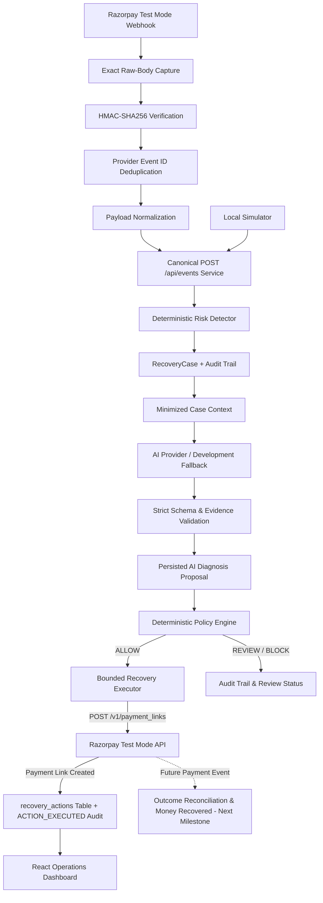

# RecoverAI Architecture — Milestones 1 to 4



## System Overview

RecoverAI is structured into strictly separated, bounded layers:

1. **Event Ingestion & Normalization**: Authenticates signed Razorpay webhooks (HMAC-SHA256), deduplicates provider event IDs, stores raw payloads, and normalizes events into canonical format.
2. **Risk Detector & Recovery Cases**: Analyzes normalized events, calculates risk levels (`LOW`, `MEDIUM`, `HIGH`), creates or updates `RecoveryCase` records, and maintains an append-only audit log.
3. **AI Diagnosis Proposal Layer (Advisory)**: Receives a minimized context (excluding secrets, raw bodies, and PII), generates structured diagnosis proposals (`CREATE_PAYMENT_LINK`, `REQUEST_MANUAL_REVIEW`, `NO_ACTION`), and enforces strict evidence grounding.
4. **Deterministic Policy Engine (Authoritative)**: Evaluates AI proposals against 12 explicit, reproducible guardrail rules before authorizing any execution.
5. **Bounded Recovery Executor**: Performs authorized recovery actions against Razorpay Test Mode APIs (`CREATE_PAYMENT_LINK`).
6. **Outcome Reconciliation (Deferred)**: Reconciles executed recovery actions against subsequent payment completion events to attribute actual recovered revenue.

---

## Authority & Execution Model

The system enforces a strict non-negotiable authority model:

```text
AI (Advisory Recommendation)
  ↓
Policy Engine (Authoritative Decision)
  ↓ (ALLOW)
Executor (Bounded Financial Execution)
  ↓
Razorpay Infrastructure (External Payment System)
  ↓
Outcome Reconciliation (Future Milestone)
```

- **AI cannot execute**: The AI layer produces structured proposals only. It has no network client, credentials, or authority to interact with payment gateways.
- **Policy Engine is authoritative**: No controller or endpoint may invoke the executor without a server-side `ALLOW` decision from `evaluatePolicy()`.
- **Executor is isolated**: Only `backend/src/actions/paymentLinkExecutor.js` and `backend/src/services/razorpayClient.js` can call the Razorpay API.

---

## Policy Engine Guardrails (`recoverai-policy-v1`)

The Policy Engine (`backend/src/policy/policyEngine.js`) evaluates 12 deterministic rules for every recovery action request:

| Rule | Name | Condition for BLOCK / REVIEW |
|---|---|---|
| 1 | `terminal_payment` | BLOCK if payment status is `captured`, `paid`, or `refunded`, or `order.status` is `paid`. |
| 2 | `case_status` | BLOCK if case status is `RESOLVED` or `SUPPRESSED`. |
| 3 | `action_allowlist` | BLOCK if action is not `CREATE_PAYMENT_LINK`; REVIEW if action is `REQUEST_MANUAL_REVIEW`. |
| 4 | `confidence_threshold` | REVIEW if AI confidence $< 0.65$. |
| 5 | `max_attempts` | REVIEW if automated recovery attempts $\ge 2$. |
| 6 | `duplicate_action` | BLOCK if an active or executed recovery action already exists for the case. |
| 7 | `amount_integrity` | BLOCK if amount $\le 0$ or invalid. |
| 8 | `high_value_escalation` | REVIEW if amount $> \text{₹}25,000$ ($2,500,000$ paise). |
| 9 | `cooldown_period` | REVIEW if elapsed time since previous attempt $< 30$ minutes. |
| 10 | `context_integrity` | BLOCK if required case fields (`paymentId`, `amount`, `currency`) are missing. |
| 11 | `test_mode_verification` | BLOCK if application is not configured for Razorpay Test Mode (`rzp_test_...`). |
| 12 | `resolved_outcome_check` | BLOCK if payment outcome is resolved or refunded in case history. |

Decision Precedence: `BLOCK` $\succ$ `REVIEW` $\succ$ `ALLOW`.

---

## Bounded Recovery Executor & Idempotency

The executor (`backend/src/actions/paymentLinkExecutor.js`) manages the execution lifecycle:

- **Action Lifecycle States**: `PENDING` $\rightarrow$ `APPROVED` $\rightarrow$ `EXECUTING` $\rightarrow$ `EXECUTED` / `FAILED` / `BLOCKED` / `REVIEW_REQUIRED`.
- **Deterministic Idempotency Key**: Generated as `razorpay_case_{caseId}_plink_v{attempt}`. Unique constraint on `recovery_actions.idempotency_key` prevents duplicate link creation at database and application levels.
- **Payment Link API**: Calls Razorpay's `POST /v1/payment_links` via HTTP Basic Auth (`RAZORPAY_KEY_ID`, `RAZORPAY_KEY_SECRET`).
- **Persistence**: Persists `provider_action_id` (Payment Link ID) and `payment_link_url` into PostgreSQL table `recovery_actions`.

---

## Stopped & Deferred Layers

- **Payment Link Creation $\neq$ Money Recovered**: Creating a Payment Link transitions action status to `ACTION_EXECUTED`. It does **NOT** count as recovered revenue until a subsequent `payment.captured` or `order.paid` event is received and reconciled.
- **Deferred Milestones**: Automated retries, customer SMS/email messaging, refunds, discounts, subscriptions, multi-action orchestration, and batch statistical reconciliation are deferred to future milestones.
