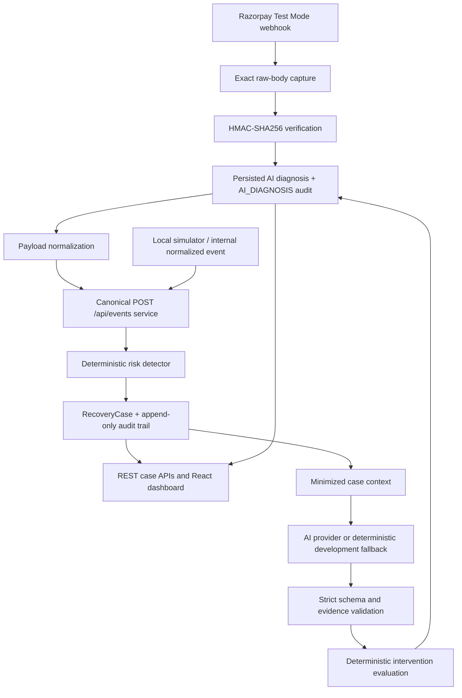

# RecoverAI architecture — milestones 1, 2, and 3



## Current flow

`POST /api/events` is the canonical normalized-event processing boundary. It stores the event, applies the shared deterministic detector, creates or updates a `RecoveryCase`, and appends audits. Razorpay is an event source; it does not have a separate risk detector or case engine.

The Razorpay adapter at `POST /api/webhooks/razorpay` is registered before Express JSON parsing with `express.raw()`. It verifies the exact received bytes with `crypto.createHmac('sha256', RAZORPAY_WEBHOOK_SECRET)` and a constant-time comparison against `X-Razorpay-Signature`. The body is parsed only after authentication. Missing or invalid signatures are rejected before raw-event persistence and business processing; secrets and raw sensitive payloads are not logged.

An authenticated delivery requires `x-razorpay-event-id`. The `provider_webhook_events` table has a unique `(provider, provider_event_id)` constraint, preserving the exact UTF-8 raw payload, event type, signature-verification result, received time, processing status, and processing error. The normal adapter path writes `PROCESSING`, runs the canonical event service, and marks it `PROCESSED` in one PostgreSQL transaction. A crash rolls the transaction back, so a provider retry can safely process once. Authenticated malformed/unsupported payloads are retained as `FAILED`; invalid unauthenticated requests are deliberately not persisted.

Supported event types are `payment.failed`, `payment.authorized`, `payment.captured`, and `order.paid`. The normalizer extracts only supplied payment/order entity fields: payment ID, order ID, amount, currency, payment status, failure information, customer/reference, and provider timestamp. Missing required canonical fields cause a malformed-payload result rather than invented data.

`payment.failed` creates or escalates a recovery case. `payment.captured` and `order.paid` resolve an existing case. Once a terminal payment event has been recorded for a payment, a later-delivered `payment.failed` is stored but cannot create or reopen a case. This prevents arrival order from overriding a known terminal provider state.

The React dashboard reads the actual case APIs and calculates its totals from returned cases. The Node simulator submits fixed scenarios; it does not generate random or dashboard-only data.

## AI diagnosis proposals

`POST /api/cases/:id/diagnosis` is explicit; no background or list-query AI call exists. It builds a minimized deterministic context from the case and normalized events. Context includes amount, currency, case/risk status, latest payment/order state, recorded failure reason, failure count, elapsed failure time, and five recent normalized event summaries. It excludes raw payloads, secrets, credentials, and customer references.

The provider adapter is replaceable. With `AI_API_KEY`, the included OpenAI-compatible adapter calls the configured provider/model; without a key, the deterministic development fallback is used and persisted as `development_fallback`. The fallback exists for reproducible development only and does not represent measured AI performance.

Provider output must validate against a strict JSON schema: diagnosis cause, numeric confidence, exact context-grounded evidence, and a limited proposed action (`CREATE_PAYMENT_LINK`, `REQUEST_MANUAL_REVIEW`, or `NO_ACTION`). Invalid/malformed output, unknown actions, missing evidence, and invented evidence are rejected. A versioned prompt (`recoverai-diagnosis-v1`) states that the model cannot execute money movement.

The application separately evaluates all three conceptual interventions using `recovery-heuristic-v1`:

```text
estimated recovery value = estimated recovery probability × recoverable amount
                           − intervention cost − estimated friction
```

These values are transparent heuristic assumptions, not learned probabilities or claimed results. Low confidence deterministically selects manual review. Resolved, suppressed, captured, paid, or refunded cases receive persisted `NO_ACTION` from a terminal safety path. The accepted decision is stored once per case in `ai_diagnoses`; repeated requests return the cached decision and do not append another audit event.

AI proposes. Deterministic application logic evaluates. Policy will later authorize. The executor will later perform the bounded action.

## Local fixture replay

`pnpm replay:razorpay` signs fixture bytes in `backend/test/fixtures/razorpay` with the configured webhook secret and sends them to the HTTP webhook route. This exercises the same verification, idempotency, normalization, transaction, and canonical processing path used by real delivery. The fixtures are deterministic Razorpay-shaped test data, not live Razorpay payload captures.

## Deferred layers

In Milestone 3, the AI layer generates and validates structured diagnosis proposals. It does not perform money movement or execution.

The deterministic financial-action policy layer and bounded action executors are deferred to future milestones. No payment link generation execution, capture execution, autonomous retries, customer messages, refunds, discounts, or other money movement exists in this milestone.
